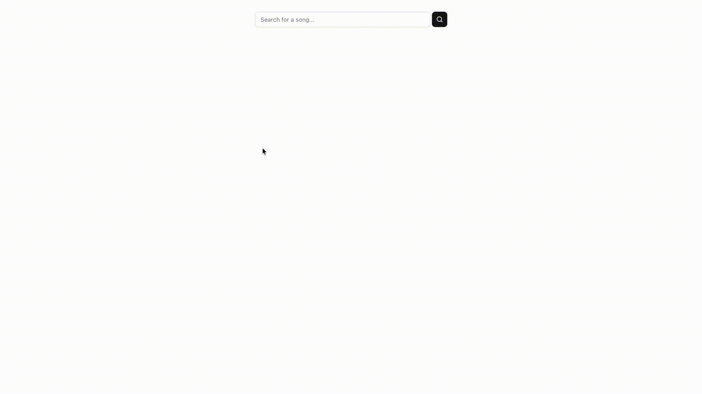

## Try it

Live: [here](https://lyrics-translator-chi.vercel.app/)

Try searching for "País do Futebol" by MC Guimê or any Portuguese song you know. Character accents aren't necessary in your search.

## Overview

Search for a song with Portuguese lyrics and quickly turn unfamiliar words into a Quizlet vocaulary set to study later. Selected words are automatically translated and shown with information about the word:
- its part of speech
- its gender (if applicable)
- its infinitive conjugation (for verbs) 
- its different meanings
- whether it's slang or not

#### Why? 

The idea for this project came up when I began learning web development while being enrolled in a university Portuguese course. I was hyperfixating on relearning the language as I come from a Brazilian family but was raised mainly speaking English. I began only listening to Brazilian music and trying to sing along while understanding what I was singing.  I hit a point where I could understand 3/4 of some songs, and that 1/4 I didn't know would consist of random words scattered across the lyrics - I didn't want the entire song translated, just bits of it. So, I would manually look up each word and throw it into a collection that I would ocasionally review. The purpose of this project was the streamline that process.

#### Note

This is the second and slightly more polished version of this project. The first iteration was used by my university Portuguese class in the Spring of 2025. After introducing it to a classmate, the app was briefly used by many in the class which consisted of roughly 25-30 students. I began to receive feature requests but they were hard to implement due to the way the first iteration was written. This prompted me to later rewrite this project.

## Usage

Search for any song with Portuguese lyrics and select it. Lyrics of your chosen song will appear. 

Click words from the lyrics to add them to your collection. You'll see your selected word and its respective metadata appear in the collection box. You may choose which meaning of the word to keep.

When you're done, press the `Export list to Quizlet` button at the bottom of the page and follow the instructions that appear to turn your collection into a Quizlet study set.

#### Note

The search is not limited to only songs with Portuguese lyrics. But, the word-lookup feature is only for Portuguese -> English. Non-Portuguese words will be detected and filtered out of your collection when exporting it.

Also, translations are done via AI then cached for future use. So, translations will take slightly longer on new words that haven't been cached yet.

## Examples

  
   
  <em>Building a collection.</em>

 

  
   
  <em>Exporting a collection to Quizlet.</em>

